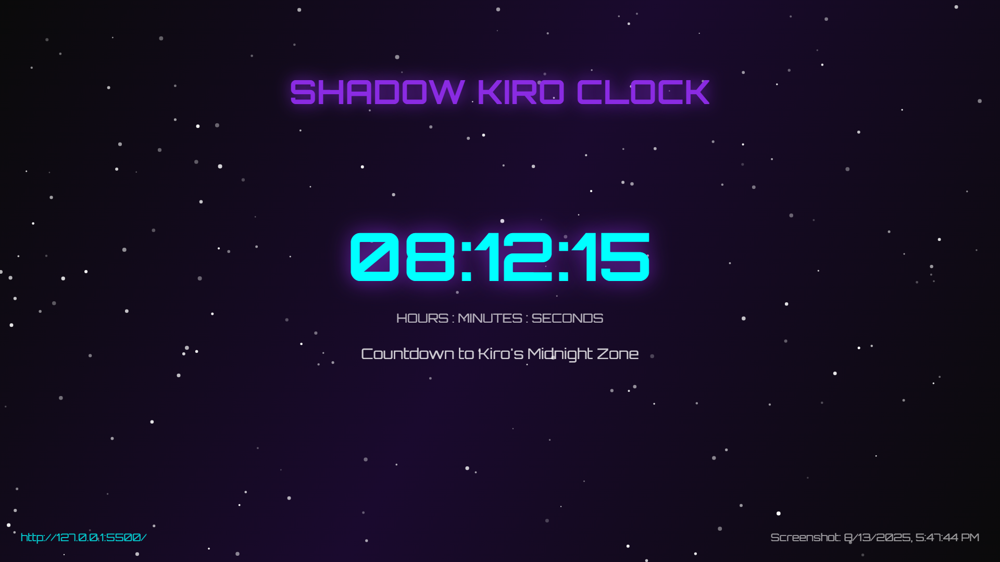

# 🌙 Shadow Kiro Clock

A futuristic countdown clock that tracks the time until Kiro's midnight (UTC 00:00) with interactive themes, smooth animations, and a built-in Pacman-style minigame featuring the Kiro logo.



## ✨ Features

### 🕐 Real-Time Countdown
- **Precise UTC tracking** - Synchronized with Kiro's timezone (UTC)
- **Multiple time displays** - Shows Kiro time, your local time, and next midnight
- **Smooth animations** - Fluid number transitions and progress bars
- **Day progress tracking** - Visual representation of how much of the day has passed

### 🎨 Interactive Themes
- **Shadow Theme** - Default dark cyberpunk aesthetic
- **Kiro Theme** - Official Kiro branding colors
- **Void Theme** - Deep space minimalist design
- **Smooth transitions** between themes

### 🎮 Kiro-Man Minigame
- **Pacman-style gameplay** with the actual Kiro logo as the player
- **Smooth 60fps animation** using requestAnimationFrame
- **4 AI-powered shadow enemies** with chase and flee modes
- **Power pellets** for temporary invincibility
- **Progressive difficulty** with level system
- **Mobile-friendly controls** (WASD or Arrow Keys)

### 🖼️ Advanced Features
- **Screenshot capture** - Save the current clock state
- **Zoom controls** - Scale the display from 50% to 300%
- **Fullscreen mode** - Immersive viewing experience
- **Share functionality** - Copy countdown link to clipboard
- **Responsive design** - Works perfectly on desktop, tablet, and mobile

### 🌟 Visual Effects
- **Animated cosmic background** with multiple particle layers
- **Floating particles** that respond to user interaction
- **Orbital rings** around the main clock display
- **Neon glow effects** throughout the interface
- **Celebration animations** when midnight is reached

## 🚀 Live Demo

Visit the live site: [Shadow Kiro Clock](https://shadow-kiro-clock.com)

## 🛠️ Technologies Used

- **HTML5 Canvas** - For the minigame rendering
- **Vanilla JavaScript** - No frameworks, pure performance
- **CSS3 Animations** - Smooth transitions and effects
- **Web APIs** - Fullscreen, Clipboard, and more
- **Responsive Design** - Mobile-first approach

## 📱 Browser Support

- ✅ Chrome 80+
- ✅ Firefox 75+
- ✅ Safari 13+
- ✅ Edge 80+
- ✅ Mobile browsers (iOS Safari, Chrome Mobile)

## 🎯 Getting Started

### Prerequisites
- A modern web browser
- Local web server (for development)

### Installation

1. **Clone the repository**
   ```bash
   git clone https://github.com/shadowwwmain/shadow-kiro-clock.git
   cd shadow-kiro-clock
   ```

2. **Serve the files**
   ```bash
   # Using Python
   python -m http.server 8000
   
   # Using Node.js
   npx serve .
   
   # Using PHP
   php -S localhost:8000
   ```

3. **Open in browser**
   ```
   http://localhost:8000
   ```

## 🎮 How to Play Kiro-Man

1. Click the **"KIRO-MAN"** button in the control panel
2. Use **WASD** or **Arrow Keys** to move Kiro around the maze
3. **Collect dots** to score points (10 points each)
4. **Grab power pellets** to make enemies vulnerable (50 points + ability to eat enemies)
5. **Avoid the shadows** or eat them when they're blue and fleeing
6. **Clear all dots** to advance to the next level

### Controls
- **Movement**: WASD or Arrow Keys
- **Start Game**: Click "START GAME"
- **Pause/Resume**: Click "PAUSE"/"RESUME"
- **Reset**: Click "RESET"
- **Close Game**: Click the "×" or click outside the modal

## 📁 Project Structure

```
shadow-kiro-clock/
├── index.html              # Main HTML file
├── assets/
│   ├── kiro-logo.png       # Kiro logo used in game and header
│   └── kiro-preview.png    # Social media preview image
├── css/
│   ├── base.css           # Base styles and variables
│   ├── layout.css         # Layout and positioning
│   ├── components.css     # Component-specific styles
│   └── mobile.css         # Responsive mobile styles
├── js/
│   ├── app.js             # Main application initialization
│   ├── countdown.js       # Core countdown functionality
│   ├── controls.js        # UI controls and interactions
│   ├── effects.js         # Visual effects and animations
│   ├── minigame.js        # Kiro-Man game logic
│   ├── screenshot.js      # Screenshot capture functionality
│   └── time-calculator.js # UTC time calculations
└── styles.css             # Legacy styles (being phased out)
```

## 🎨 Customization

### Adding New Themes
1. Add theme styles in `css/components.css`
2. Create theme button in `index.html`
3. Add theme logic in `js/controls.js`

### Modifying the Minigame
- **Game map**: Edit the `this.map` array in `js/minigame.js`
- **Enemy behavior**: Modify the AI logic in `updateEnemies()`
- **Scoring**: Adjust point values in the collision detection

### Styling
- **Colors**: Modify CSS custom properties in `css/base.css`
- **Animations**: Adjust keyframes and transitions in component files
- **Layout**: Update grid and flexbox properties in `css/layout.css`

## 🤝 Contributing

Contributions are welcome! Please feel free to submit a Pull Request.

### Development Guidelines
1. **Code Style**: Use consistent indentation and naming conventions
2. **Comments**: Document complex logic and functions
3. **Testing**: Test on multiple browsers and devices
4. **Performance**: Keep animations smooth and efficient

## 📄 License

This project is licensed under the MIT License - see the [LICENSE](LICENSE) file for details.

## 👤 Author

**Shadow**
- Discord: `1075533908613021727` (Click the profile in the footer to copy)
- GitHub: [@shadowwwmain](https://github.com/shadowwwmain)

## 🙏 Acknowledgments

- **Kiro** - For the inspiration and branding
- **Pacman** - For the classic game mechanics that inspired Kiro-Man
- **The community** - For feedback and suggestions

## 📊 Stats

- **Lines of Code**: ~2,500+
- **File Size**: ~150KB total
- **Load Time**: <2 seconds on average connection
- **Mobile Optimized**: 100% responsive design

---

⭐ **Star this repo if you found it useful!** ⭐

*Built with ❤️ by Shadow*